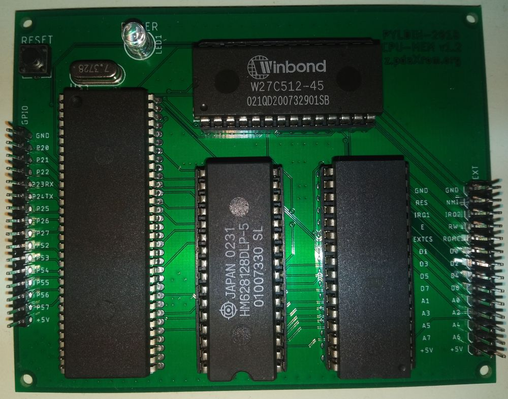

## Перерождение Пълдин-601

Здесь вы найдете проект компьютера, программно совместимого с Пълдин-601 на уровне приложений, доступного для самостоятельной сборки.

### Технические характеристики материнской платы версии 1.2

----+----
Процессор|HD63C03YP (мак. тактовая частота 3 МГц)
ОЗУ|128 КБ (статическое)
ПЗУ|128 КБ (электрически перепрограммируемое)
Порт ввода/вывода|14 бит, переконфигурируемые
Шина расширения|8 бит адрес, 8 бит данных, сигнал выбора окна периферии, прерывания, управление вводом/выводом

### Карта памяти

----+----
F000-FFFF|BIOS ПЗУ/ОЗУ
E700-EFFF|ОЗУ
E600-E6FF|Внешние устройства (EXTCS)
E000-E5FF|ОЗУ
C000-DFFF|Страницы ОЗУ/ПЗУ
0028-BFFF|ОЗУ
0000-0027|HD6303 внутренние устройства

Переключение карты адресного пространства и страниц памяти производится через внутренний порт 6 процессора. Распределение битов:

----+----+----+----+----+----+----+----
FN2|FN1|FN0|PA3|ROM|PA2|PA1|PA0

FN2-0 отвечает за выбор конфигурации адресного пространства. Текущая прошивка адресного декодера обеспечивает выбор ПЗУ в окне BIOS при 111 и ОЗУ во всех остальных случаях.

PA3-PA0 выбор страницы ОЗУ или ПЗУ. За тип выбранной страницы отвечает бит ROM (1 = ПЗУ).

Так как для ОЗУ и ПЗУ используют теже микросхемы, что и страницы памяти, то в страничной памяти возможно отображение дублирующих страниц ОЗУ или BIOS.

Для ОЗУ:

----+----
Адрес|Страница/Адрес в процессорном пространстве
1E000-1FFFF|15/Нет
1C000-1DFFF|14/Нет
1A000-1BFFF|13/Нет
18000-19FFF|12/Нет
16000-17FFF|11/Нет
14000-15FFF|10/Нет
12000-13FFF|9/Нет
10000-11FFF|8/Нет
0E000-0FFFF|7/E000-EFFF (E000-FFFF если выбран BIOS RAM)
0C000-0DFFF|6/C000-DFFF
0A000-0BFFF|5/A000-BFFF
08000-09FFF|4/8000-9FFF
06000-07FFF|3/6000-7FFF
04000-05FFF|2/4000-5FFF
02000-03FFF|1/2000-3FFF
00000-01FFF|1/0028-1FFF

