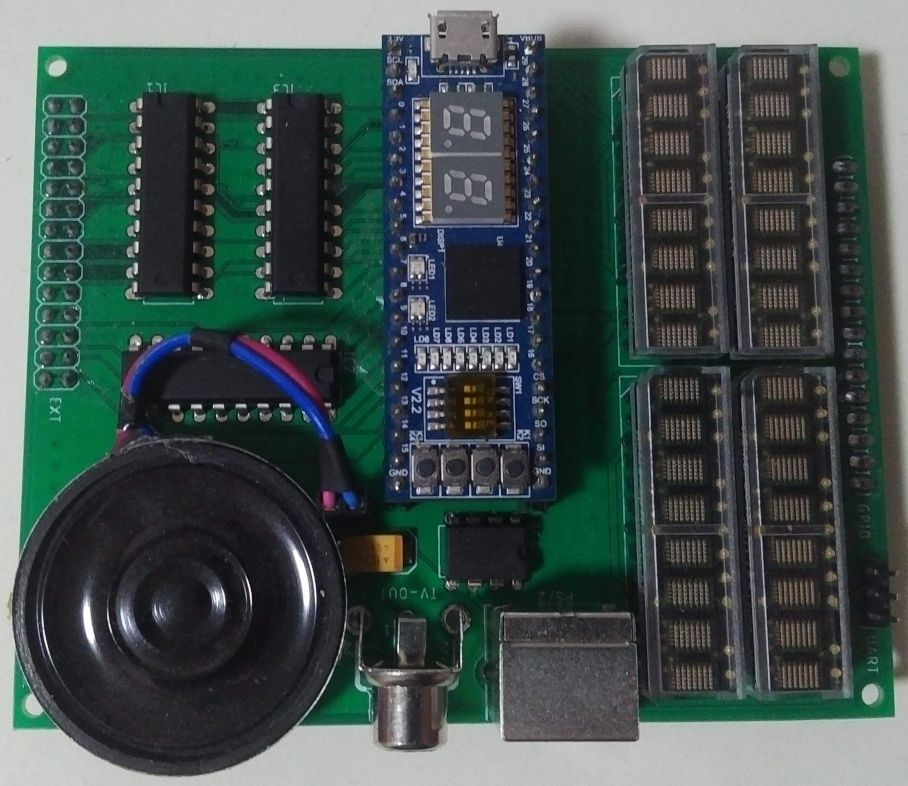

## Плата периферии

Текущая версия 1.2

Данная плата обеспечивает подключение телевизора для вывода текстовой и графической информации, клавиатуру, монофический вывод звука, работу с SD картой. Опционально доступна установка четырех светодиодных дисплеев, суммарно отображающих 16x2 символов.

[Характеристики](#характеристики)

[Адресное пространство периферийных устройств](#адресное-пространство-периферийных-устройств)

[Видеоконтроллер](#видеоконтроллер)

[SimpleIO](#simpleio)

[PSG](#psg)

[SPI](#spi)

[Клавиатура](#клавиатура)

[Маршрутизация прерываний](#маршрутизация-прерываний)

[Фотография собранной платы периферии](#фотография-собранной-платы-периферии)

### Характеристики

Функция|Описание
----|----
Внешний дисплей|Монохромный выход, PAL, 8 КБ ОЗУ видеопамяти, 2 КБ ПЗУ текстовых шрифтов
Внутренний дисплей|Опционально, светодиодный, 16x2 символа
Клавиатура|PS/2
Накопитель|SD/MMC карта памяти
Звук|Монофонический
Дополнительные порты|Последовательный порт (встроенный в процессор, +5В уровни)

### Адресное пространство периферийных устройств

Периферийные устройства доступны в окне памяти ввода-вывода E600-E6FF, что сотвествует адресации 256 байт памяти с помощью 8-бит адресной шины, выведенной на шину расширения. Память периферии делится на 8 секций размером 32 байта. Каждой секции можно назначить свою линию прерывания ([Маршрутизация прерываний](#маршрутизация-прерываний)).

Адрес|Секция
----|----
E600-E61F|DS0
E620-E63F|DS1
E640-E65F|DS2
E660-E67F|DS3
E680-E69F|DS4
E6A0-E6BF|DS5
E6C0-E6DF|DS6
E6E0-E6FF|DS7

Адрес|Устройство
----|----
E610-E61F|[Видеоконтроллер](#видеоконтроллер)
E6A0-E6AF|[SimpleIO устройства](#simpleio)
E6B0-E6B1|[PSG - Звуковой генератор](#psg)
E6C0-E6C4|[SPI - Последовательный периферийный интерфейс](#spi)
E6D0-E6D1|[Клавиатура](#клавиатура)
E6FE-E6FF|[Маршрутизация прерываний](#маршрутизация-прерываний)

### Видеоконтроллер

VPU_DATA (E610) RW - Данные

VPU_ADDR (E611) RW - 16-бит адрес видеоданных

VPU_CONFIG (E613) RW - Регистр конфигурации

7|6|5|4|3|2|1|0
----|----|----|----|----|----|----|----
IRQ|IEN|VBL|GRF|CURINV|CUR|ID|AUTO

Название|Описание
----|----
IRQ|Флаг вызова прерывания(сброс по чтению)
IEN|Разрешение прерывания по достижению значения делителя
VBL|Вертикальное прерывание
GRF|Графический режим
CURINV|Инверсия курсора
CUR|Включение курсора
ID|Уменьшение адреса данных
AUTO|Автоматическое изменение адреса данных

VPU_AUTOOFFS (E614) RW - Значение автоматического увеличения или уменьшения адреса

VPU_VADDR (E615) RW - 16-бит адрес начала видеопамяти

VPU_HSOFFS (E617) RW - Смещение изображения слева экрана (NN * 8 точек)

VPU_VSOFFS (E618) RW - Смещение изображения от верха экрана (линии)

VPU_HSIZE (E619) RW - Ширина изображения (NN / 8 точек - 1)

VPU_VSIZE (E61A) RW - Высота изображения (в линиях - 1)

VPU_CURPOS (E61B) RW - Горизонтальное положение курсора (NN / 8 точек)

VPU_CURLINS (E61C) RW - Вертикальное положение курсора начало (линия)

VPU_CURLINE (E61D) RW - Вертикальное положение курсора конец (линия)

### SimpleIO

IO_TIM_CONFIG (E6A8) RW - Регистр конфигурации таймера

7|6|5|4|3|2|1|0
----|----|----|----|----|----|----|----
IRQ|IEN|-|-|-|-|-|RUN

Название|Описание
----|----
IRQ|Флаг вызова прерывания(сброс по чтению)
IEN|Разрешение прерывания по достижению значения делителя
RUN|Запуск таймера

IO_TIM_DIV (E6A9) RW - 24-бит делитель (базовая частота 12 МГц) или счетчик, если таймер запущен

Опциональные устройства:

IO_L8BIT (E6A0) RW - 8 светодиодов

IO_L7HI (E6A1) RW - 7-сегментный индикатор и запятая

IO_L7LO (E6A2) RW - 7-сегментный индикатор и запятая

IO_L2RGB (E6A3) RW - 2 RGB светодиода

7|6|5|4|3|2|1|0
----|----|----|----|----|----|----|----
-|R1|G1|B1|-|R2|G2|B2

IO_SWKEYS (E6A4) R - ключи и кнопки

7|6|5|4|3|2|1|0
----|----|----|----|----|----|----|----
SW3|SW2|SW1|SW0|KEY3|KEY2|KEY1|KEY0

### PSG

Звуковой генератор совмести с YAMAHA YM-2149.

PSG_DATA (E6B0) RW - Данные

PSG_ADDR (E6B1) W - Адрес

### SPI

SPI_DATA (E6C0) RW - Данные 16 бит

SPI_CONFIG (E6C2) RW - Регистр конфигурации

7|6|5|4|3|2|1|0
----|----|----|----|----|----|----|----
READY|-|SSM|16B|SS3|SS2|SS1|SS0

Название|Описание
----|----
READY|Флаг готовности
SSM|Программное управление выбором периферии
16B|16-бит SPI
SS3-SS0|Сигналы выбора периферийного устройства

SPI_PRESCALER (E6C3) RW - Делитель частоты синхронизации

SPI_POUT (E6C4) RW - Дополнительные биты сигнала выбора периферии (только программно)

### Клавиатура

PS2_DATA (E6D0) RW - Данные клавиатуры

PS2_CONFIG (E6D1) RW - Регистр конфигурации

Регистр конфигурации

7|6|5|4|3|2|1|0
----|----|----|----|----|----|----|----
IRQ|IEN|RDY|BSY|TIM|E1|E0|REL

Название|Описание
----|----
IRQ|Флаг вызова прерывания (сброс по чтению)
IEN|Разрешение прерывания от клавиатуры
RDY|Данные готовы
BSY|Клавиатура занята
TIM|Время ожидания передачи данных вышло
E1|Присутствует префикс E1
E0|Присутствует префикс E0
REL|Клавиша отжата

Последовательное нажатие клавиш CTRL+LALT+RALT+DEL вызывает аппаратную перезагрузку.

### Маршрутизация прерываний

INT_ROUTER (E6FE) RW - 16 битный регистр назначение прерываний

15 14|13 12|11 10|09 08|07 06|05 04|03 02|01 00
----|----|----|----|----|----|----|----
DS7 | DS6 | DS5 | DS4 | DS3 | DS2 | DS1 | DS0

Биты|Прерывание
----|----
0 0|IRQ1
0 1|IRQ2
1 0|NMI
1 1|RESET

### Фотография собранной платы периферии

